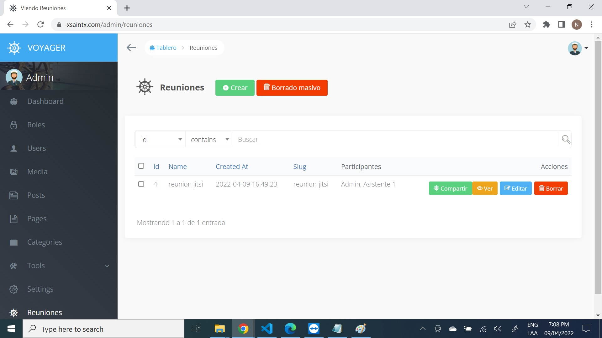
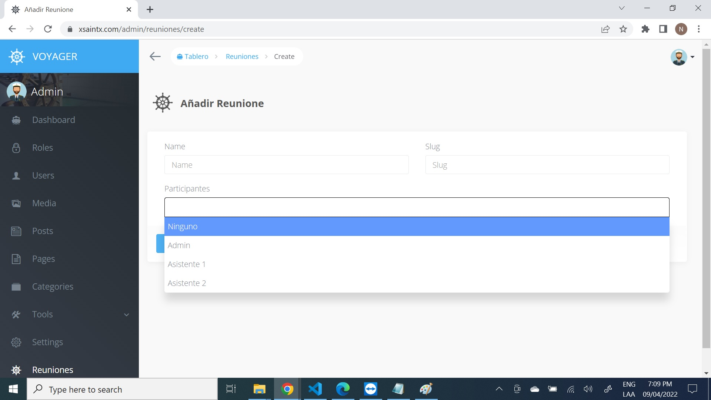

## Videocall Laravel
This project uses voyager and mysql
- First step is login with the default user (admin@admin.com and password by default)

- After login you will go to Tools > Databases Option.

- On Create Table we will create our table which allow us to create a meeting, for this sample I called reuniones with columns name and slug.

- After that you will see on the left side as menu option, so you can click on it and you will see like this.

- When you press create you will see the next fields to fill, in the combobox option is for allowing which users can connect to that meeting.

- After saving, on the list you will see compartir button, that button will be useful to send to the user which will connect to the videocall.
- If any other user wants to connect that will not be possible because in this crud we set which ones are allowed to connect.
- If the user wants to connect he can logins here.

- After logging we can send the link and only that user will connect to the videocall.
- To see how it works you can write me by email nsoriano256@hotmail.com
